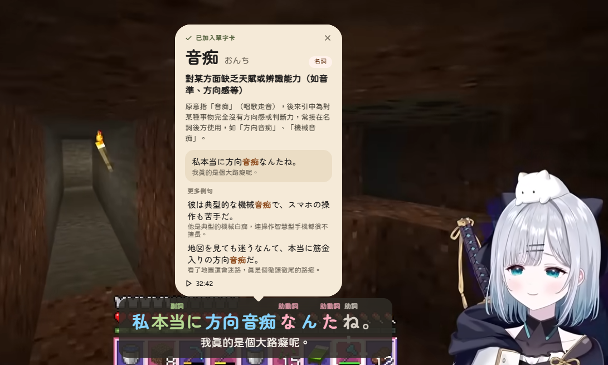

> > # 語言 / Language
> - [中文說明](#日文字幕單字分詞顯示工具)
> - [English Description](#caption-wordinizer)

---

# 日文字幕單字分詞顯示工具
## 目次
- [規格和設計](doc/spec.md)
- [待完成的功能](doc/wait-feat.md)
- [這是什麼](#這是什麼)
- [畫面展示](#畫面展示)
- [安裝教學](#安裝教學)
- [使用方式](#使用方式)
- [開發紀錄](#開發紀錄)

## 這是什麼?
這是一款能幫助您學習與理解日文的 Chrome 擴充功能：

1. 它會使用分詞器（tokenizer），根據日文單字的詞性將字幕進行斷詞。
2. 每個**斷詞段落都會根據其詞性標上不同的顏色**。
3. 您可以自由切換是否要**顯示特定的詞性名稱**。
4. 只要您願意，可以**將任何特定的單字加入成為您的單字卡**。
5. 新增的單字卡可以匯出，並**匯入至 Anki 中**。
6. 除了原始字幕外，您還能即時**看到該句字幕的完整翻譯**。
7. 目前共有兩種目標翻譯語言可供選擇（繁體中文、English）。

## 畫面展示

## 安裝教學
1. 下載或 `git clone` 這個專案。
2. 在 Chrome 開啟 `chrome://extensions`，打開右上角的「開發人員模式」。
3. 點「載入未封裝項目」，選擇專案根目錄（有 `manifest.json` 的資料夾）。
4. （選用）點擴充功能圖示，填入 [Gemini API Key](https://aistudio.google.com/apikey)。單字卡的字義與 Gemini 翻譯需要它；Google 翻譯不需要。

## 使用方式
- 打開一支有日文字幕（人工或自動產生）的 YouTube 影片，上色後的字幕會取代原本的字幕。
- 滑鼠停在單字上會出現提示框（原形、原形讀音、詞性、讀音）；**點一下單字**就會加入單字卡，加入後會在單字上方顯示單字卡預覽，點預覽卡的時間可跳回該句。
- 助詞、助動詞和語尾（例如「戻っ｜たんだ」的「たんだ」）是文法：點一下會建立**文法卡**，由 Gemini 說明它的功能和用法。設定頁的「斷詞單位」可選 詞／語幹＋語尾／詞組。
- 擴充功能的「設定」分頁：開關功能、切換介面語言（中 / EN）、顯示翻譯、重新斷句、斷詞單位、翻譯語言與引擎、字幕位置與大小、Gemini API Key 與模型、選擇要顯示名稱的詞性。
- 「單字卡」分頁：點卡片會跳出完整預覽卡（意思、說明、例句、補充例句、翻譯、影片時間連結），可單張刪除。沒有 API Key 等原因導致字義生成失敗的卡片，可以用頂端的「一鍵補生成」重新產生。
- 單字卡匯出：「單字卡」分頁點「匯出 Anki (.txt)」，在 Anki 選「檔案 → 匯入」，筆記類型選「基本型」即可。正面是單字，背面會有讀音、意思、詞性、說明、例句、翻譯和影片連結。
  - 想用自訂的筆記類型：匯出檔第 3 欄之後是各項目的獨立欄位（單字、讀音、意思、詞性、說明、例句、例句翻譯、影片連結、補充例句），匯入時對應到自己的欄位即可。

## 開發紀錄
- **2026-09-28 v0.1**：完成 [spec](doc/spec.md) 中所有模組（字幕抓取、斷詞、上色、顯示、翻譯、單字卡、Anki 匯出、設定頁）。詳細內容見 [spec 的完成紀錄](doc/spec.md#完成紀錄)，尚未完成的項目見 [wait-feat](doc/wait-feat.md)。
- **2026-09-28**：API Key 改為單獨保存，content script 讀不到；預設模型改為 `gemini-3.1-flash-lite`。
- **2026-09-28**：長影片分段翻譯，只翻目前播放位置往後約 2 分鐘，跳轉時新位置優先，20 分鐘以上的影片也能馬上看到翻譯。
- **2026-09-28**：依 `doc/UI mockups form` 的 Organic 設計改版字幕、提示框、toast、單字卡預覽與設定頁，新增介面語言切換（中 / EN），字型改為內附。
- **2026-09-28**：預覽卡的時間連結以 videoId 判斷影片，只在同一支影片時跳轉，不同影片會顯示提示。
- **2026-09-28**：popup 點單字卡會跳出完整預覽卡（和影片上的同一個樣式）。
- **2026-09-28**：字幕中的 `[音楽]`、`[拍手]` 等方括號標籤會自動刪除。
- **2026-09-28**：依標點符號重新斷句，一句一行顯示（設定頁「依標點斷句」可關閉）。
- **2026-09-28**：字幕中的標點符號不可點擊，不會被加入單字卡。
- **2026-09-28**：沒有標點的自動字幕改用詞性＋停頓斷句；自動字幕的換句時間精確到詞。設定改名為「重新斷句」。
- **2026-09-28**：新增字幕位置（下方 / 上方、距離邊緣）與大小設定。
- **2026-09-28**：Anki 匯出可直接用「基本型」匯入，背面會顯示讀音、意思、詞性、例句等全部內容。
- **2026-09-28**：Anki 背面重新排版：分成「讀音 / 解釋 / 例句」三段並加上標題，字級主次分明。
- **2026-09-28**：新增「斷詞單位」設定（預設語幹＋語尾），點助詞、助動詞、語尾會建立文法卡。

---

# Caption-Wordinizer
## Table of contents
- [Spec and design](doc/spec.md)
- [Features not implemented yet](doc/wait-feat.md)
- [What is it?](#what-is-it)
- [Showcase](#showcase)
- [Setup Guide](#setup-guide)
- [Usage](#usage)
- [Changelog](#changelog)

## What is it?
It's a chrome extension that can help you learn and understand Japanese.
1. It uses a tokenizer to segment captions by the part of speech of each Japanese word.
2. Each **segment is colored** according to its part of speech.
3. You can choose whether to **show the name of specific parts of speech**.
4. You can **add any word as a wordcard** whenever you like.
5. Wordcards can be exported and **imported into Anki**.
6. In addition to the original caption, you'll **see the full translation of that line** in real time.
7. Two target translation languages are currently available (Traditional Chinese, English).

## Showcase

## Setup Guide
1. Download or `git clone` this repository.
2. Open `chrome://extensions` in Chrome and turn on **Developer mode**.
3. Click **Load unpacked** and select the project root (the folder containing `manifest.json`).
4. (Optional) Open the extension popup and enter a [Gemini API key](https://aistudio.google.com/apikey). It is needed for wordcard meanings and Gemini translation; Google Translate works without it.

## Usage
- Open a YouTube video with Japanese captions (manual or auto-generated). The colored captions replace the native ones.
- Hover a word for a tooltip (dictionary form and its reading, part of speech, reading); **click it** to add it as a wordcard. A preview of the new card appears above the word, and its timestamp jumps back to that line.
- Particles, auxiliaries and endings (e.g. たんだ in 戻っ｜たんだ) are grammar: clicking one creates a **grammar card** explained by Gemini. Choose word / stem + ending / phrase under "Segmentation" in Settings.
- Popup **Settings** tab: toggle the extension, switch the UI language (中 / EN), show translation, re-split sentences, choose the segmentation unit, choose the target language and translation engine, set caption position and size, enter the Gemini API key and model, and pick which parts of speech show their names.
- Popup **Wordcards** tab: click a card to open its full preview card (meaning, explanation, sentence, extra examples, translation, timestamp link), or delete it. Cards whose meaning failed to generate (e.g. no API key) can be regenerated with **Regenerate all** at the top.
- Export: click **Export Anki (.txt)** in the Wordcards tab, then use **File → Import** in Anki with the **Basic** note type. The front shows the word; the back shows the reading, meaning, part of speech, explanation, sentences, translation and video link.
  - Want a custom note type? Columns 3 onward hold each field separately (word, reading, meaning, part of speech, explanation, sentence, sentence translation, video link, extra examples); map them to your own fields when importing.

## Changelog
- **2026-09-28 v0.1**: all modules in the [spec](doc/spec.md) implemented (caption fetching, tokenizing, coloring, display, translation, wordcards, Anki export, settings popup). See the [spec's changelog](doc/spec.md#changelog) for details and [wait-feat](doc/wait-feat.md) for what's left.
- **2026-09-28**: the API key is stored separately and content scripts can't read it; default model is now `gemini-3.1-flash-lite`.
- **2026-09-28**: chunked translation for long videos: only ~2 minutes ahead of playback is translated and seeks take priority, so 20+ minute videos show translations right away.
- **2026-09-28**: Organic redesign (from `doc/UI mockups form`) of the caption overlay, tooltip, toasts, wordcard preview and popup; added a UI language switch (中 / EN) and bundled fonts.
- **2026-09-28**: the preview card's timestamp checks the video ID; it only seeks within the same video and shows a notice otherwise.
- **2026-09-28**: clicking a wordcard in the popup opens the full preview card (same design as on the video).
- **2026-09-28**: bracket tags such as `[音楽]` and `[拍手]` are removed from captions.
- **2026-09-28**: captions are re-split at punctuation so each line is one sentence (toggle "Split by punctuation" in Settings).
- **2026-09-28**: punctuation in captions is no longer clickable and can't be added as a wordcard.
- **2026-09-28**: unpunctuated auto captions are split into sentences by part of speech and pauses; auto-caption timing is now word-accurate. The setting is now "Re-split sentences".
- **2026-09-28**: added caption position (bottom / top, distance from edge) and size settings.
- **2026-09-28**: the Anki export can be imported with the Basic note type; the back shows the reading, meaning, part of speech, sentences and more.
- **2026-09-28**: redesigned the Anki card back: labeled Reading / Meaning / Examples sections with a clear font-size hierarchy.
- **2026-09-28**: new "Segmentation" setting (default: stem + ending); clicking a particle, auxiliary or ending creates a grammar card.
